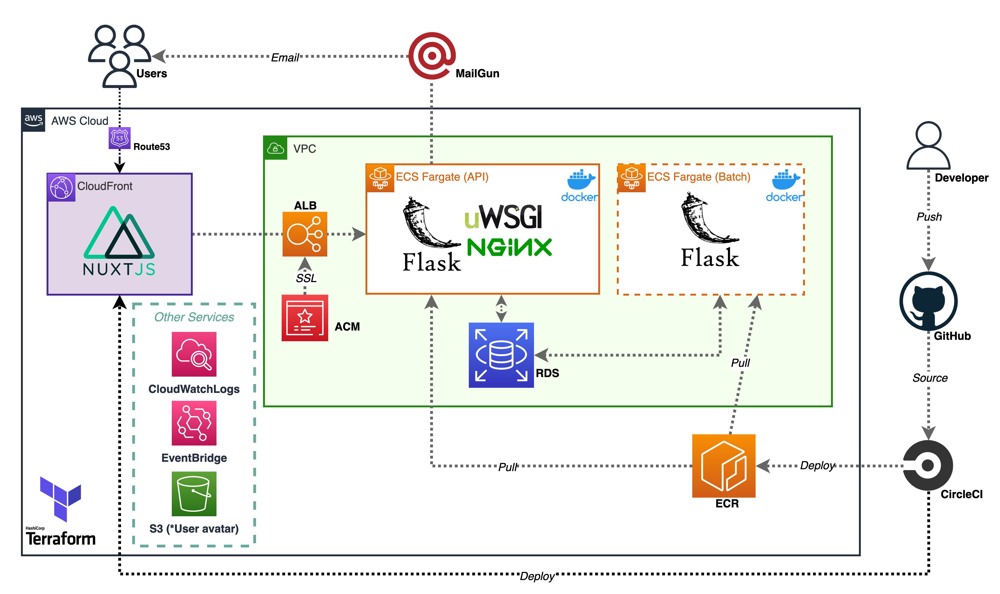
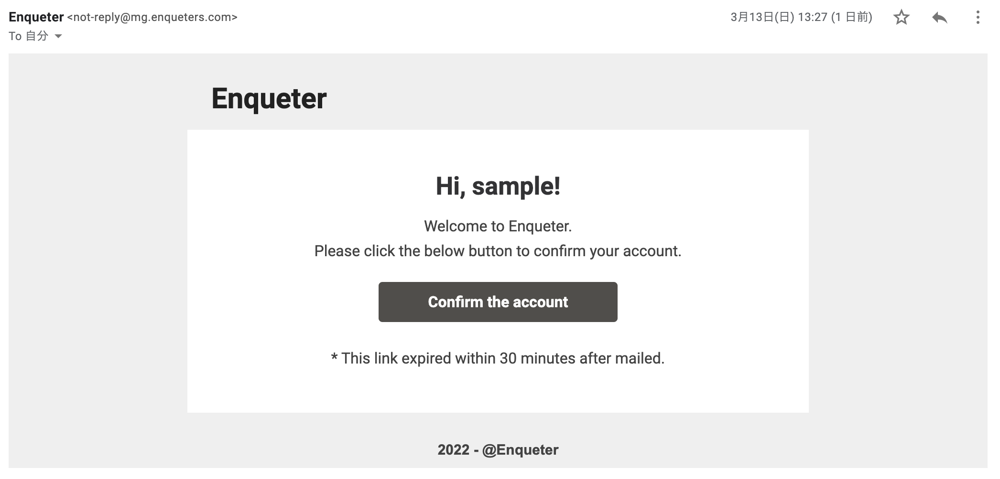

# Enqueter
タイトルの「Enqueter」はフランス語の「enquete(アンケート)」を由来にした造語です。

> https://enqueters.com

> https://tubuanpanman.com/document (*OpenAPI)


`説明`

  一つの質問に対して多数派だと思う方を選択しポイントを獲得するミニゲームサービスです。
「朝食はとる派かとらない派」はたまた「たけのこ里派かきのこの山派」などの意見が分かれる不毛な論争への一種のアンサーになればと考えこのアプリケーションを作成しました。多数派を選択すればポイントを獲得できるというインセンティブを実装することで偏見に囚われない集計が期待できます。

`ログイン`

サインアップにE-mail認証を使用していますが、煩わしいという方は以下のいづれかのユーザーでお試しください。
```
Email: test1@example.com ~ test5@example.com
Password: testpassword 
```

`イメージ`


# Technologies

`Development`
* MacOS(BigSur)
* IntelliJ IDEA(python community edition)
* visual studio code

`Technologies`

* Python:3.9.6(Flask:2.0.2)
* TypeScript(Vue.js*Nuxt.js)
* Vuetify
* Docker
* AWS
* CircleCI
* Terraform:1.0.9
* MailGun

`Backend`

|  Name  |  Description  |
| ---- | ---- |
|  Flask  | Backend API server |
|  Swagger  | OpenAPI |
|  MySQL  | Database  |
|  Flask-Migrate  | DB migration  |
|  MailGun(*external api)  | Email service (used in authentication)  |

`Frontend`

|  Name  |  Description  |
| ---- | ---- |
|  Nuxt.js (SPA mode)  | Vue.js framework  |
|  Vuetify  | UI framework |

`Infrastructure`

|  Name  |  Description  |
| ---- | ---- |
|  ECS Fargate  | Container service for production env |
|  EventBridge | Batch processing on Faragte  |
|  CloudFront  | Delivering SPA contents  |
|  S3  | Saving user's avatars|
|  RDS  | DB managed service (MySQL)  |
|  CloudWatch Logs  | Log monitoring  |
|  Docker  | Container environment |
|  CircleCI  | CI/CD pipeline |
|  Terraform  | IaC tool |

# Functinos
Main functions in the app.

`Basic`
| Function | Description |
| ---- | ---- |
| Follow | Follow each other |
| Search | Search another users |
| Notification | Get notification triggered by some events |
|  Create | Create Questions |
|  Answer | Answer any questions and get points |
|  Bookmark | Bookmark any questions |
|  Avatar | Set any avatar |
|  Pagination | Paginating questions |
|  InfiniteLoading | Questions is loaded per some numbers in some pages |

`Authentication`
|  Function  |  Description  |
| ---- | ---- |
| JWT | Authentication token |
| E-mail | Confirm users by E-mail |
| Forgot password |Users can reset password (* with E-mail) |
| Change E-mail | Users can change registered E-mail with PIN (* with E-mail) |

`Others`
|  Function  |  Description  |
| ---- | ---- |
| Batch | Aggregate ranking data at regular intervals |

# Structures

`AWS`



`API`


`DB`


`E-mail`




# Testing API by Docker

For testing, get as close as possible to ECS environment.

`Command`

```bash
# Start project (*--no-cache is optional)
$ docker-compose build --no-cache

# Start
$ docker-compose up -d

# Execute migrate container 
$ docker run --rm --net='enqueter_default' --name migrate_task -it \
  -e SQLALCHEMY_DATABASE_URI='mysql+pymysql://production:production@db/production?charset=utf8mb4' enqueter_api flask db upgrade

# Execute seed container 
$ docker run --rm --net='enqueter_default' --name seed_task -it \
  -e SQLALCHEMY_DATABASE_URI='mysql+pymysql://production:production@db/production?charset=utf8mb4' enqueter_api sh shell/seed.sh

# Execute batch container
$ docker run --rm --net='enqueter_default' --name batch_task -it \
  -e SQLALCHEMY_DATABASE_URI='mysql+pymysql://production:production@db/production?charset=utf8mb4' enqueter_api sh shell/batch.sh
```

`Attention`

In the local without private environment variables, sending email with MailGun and S3 upload are not available.