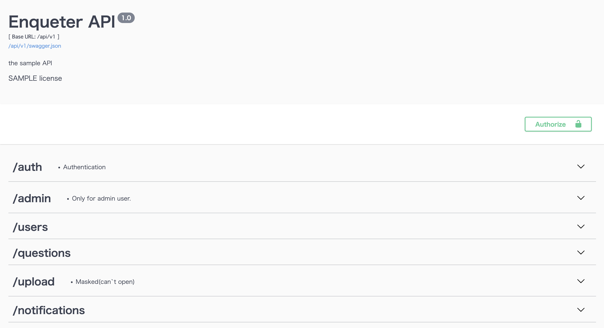

# Enqueter

Enqueteは「アンケート」を意味します。


> https://enqueters.com

一つの質問に対して多数派だと思う方を選択しポイントを獲得するミニゲームサービスです。
「朝食はとる派かとらない派」はたまた「たけのこ里派かきのこの山派」などの意見が分かれる不毛な論争への一種のアンサーになればと考えこのアプリケーションを作成しました。多数派を選択すればポイントを獲得できるというインセンティブを実装することで偏見に囚われない集計が期待できます。

<!--  -->


# Technologies

`Development`
* MacOS(BigSur)
* InteliJIDEA(python community edition)
* VScode

`Technologies`

* Python:3.9.6(Flask)
* TypeScript(Vue.js*Nuxt.js)
* Vuetify
* Docker
* AWS
* CircleCI
* Terraform:1.0.9
* MailGun

`Backend`

|  Name  |  Description  |
| ---- | ---- |
|  Flask  | Backend API server |
|  Swagger  | API Document |
|  MySQL  | Database  |
|  Flask-Migrate  | DB migration  |
|  MailGun(*external api)  | Email service (used in authentication)  |

`Frontend`

|  Name  |  Description  |
| ---- | ---- |
|  Nuxt.js (SPA mode)  | Vue.js framework  |
|  Vuetify  | UI framework |

`Infrastructure`

|  Name  |  Description  |
| ---- | ---- |
|  ECS Fargate  | Container service for production env |
|  ECS Scheduled Task | Batch processing on Faragte  |
|  CloudFront  | Delivering SPA contents  |
|  S3  | Saving user's avatars|
|  RDS  | DB managed service (MySQL)  |
|  CloudWatch Logs  | Log monitoring  |
|  Docker  | Container environment |
|  CircleCI  | CI/CD pipeline |
|  Terraform  | IaC tool |

# Functinos
Main functions in the app.

`Basic`
| Function | Description |
| ---- | ---- |
| Follow | Users can follow each other |
| Search | Users can search another users |
| Notification | Users can get notification triggered by some events |
|  Create | Users can create Questions |
|  Answer | Users can answer any questions and get points |
|  Bookmark | Users can bookmark any questions |
|  Avatar | Users can set any avatar |
|  Pagination | Questions is paginated in "Questions" page |
|  InfiniteLoading | Questions is loaded per some numbers in some pages |

`Authentication`
|  Function  |  Description  |
| ---- | ---- |
| JWT | Authentication token |
| E-mail | Confirm users by E-mail |
| Forgot password |Users can reset password (* with E-mail) |
| Change E-mail | Users can change registered E-mail with PIN (* with E-mail) |

`Others`
|  Function  |  Description  |
| ---- | ---- |
| Batch | Aggregate ranking data at regular intervals |

# Structures

`AWS` (* draw.io)


`API` (* Swagger Document)



`DB` (* DB Designer)


# Start API by Docker

`Command`

```bash
# Start project (*--no-cache is optional)
$ docker-compose build --no-cache

# Start
$ docker-compose up -d

# Execute seed container 
$ docker run --rm --net='enqueter_default' --name seed_task -it \
  -e SQLALCHEMY_DATABASE_URI='mysql+pymysql://production:production@db/production?charset=utf8mb4' enqueter_api sh shell/seed.sh

# Execute batch container
$ docker run --rm --net='enqueter_default' --name batch_task -it \
  -e SQLALCHEMY_DATABASE_URI='mysql+pymysql://production:production@db/production?charset=utf8mb4' enqueter_api sh shell/batch.sh
```

`Attention`

Sending Email with MailGun and S3 upload are not available.